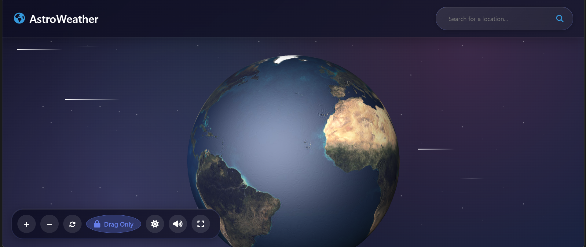

# AstroWeather - Interactive 3D Globe

AstroWeather is an interactive 3D globe web application that displays real-time weather data and allows users to explore the Earth in a visually stunning interface. Similar to Google Earth or TV Garden, this application provides an immersive experience with day/night visualization, weather information, and location search capabilities.



## Features

- **Interactive 3D Globe**: Rotate, zoom, and interact with a high-quality 3D Earth model
- **Real-time Weather Data**: Click on any location to view current weather conditions
- **AI-Powered Clothing Recommendations**: Get personalized clothing suggestions based on current weather conditions using decision tree logic
- **Day/Night Visualization**: Toggle between day and night views of Earth
- **Location Search**: Find and navigate to specific locations around the globe
- **7-Day Weather Forecast**: View extended weather predictions
- **Air Quality Information**: Monitor air pollution levels
- **Responsive Design**: Works on desktop and mobile devices
- **Beautiful UI**: Clean, modern interface with smooth animations

## Demo

You can try the live demo [here](#) (replace with your deployed URL)

## Technologies Used

- **Three.js**: For 3D rendering and globe visualization
- **OpenWeatherMap API**: For weather data and geocoding
- **Font Awesome**: For icons
- **Vanilla JavaScript**: No framework dependencies

## Setup and Installation

1. Clone the repository:
   ```bash
   git clone https://github.com/yourusername/astro-weather.git
   cd astro-weather
   ```

2. Install dependencies:
   ```bash
   npm install
   ```

## API Key Setup

To use the weather data features, you need to obtain a free API key from OpenWeatherMap:

1. Go to [OpenWeatherMap](https://openweathermap.org/) and create a free account
2. Navigate to your API keys section in your account dashboard
3. Generate a new API key (or use an existing one)
4. Open the `app.js` file in the project
5. Replace `YOUR_OPENWEATHERMAP_API_KEY` with your actual API key:

```javascript
const WEATHER_API_KEY = 'your-api-key-here'; // Replace with your API key
```

**Note:** The free tier of OpenWeatherMap API allows up to 1,000 API calls per day, which is sufficient for personal use.

5. Start the development server:
   ```bash
   npm start
   ```

6. Open your browser and navigate to `http://localhost:8080`

## Usage

- **Rotate Globe**: Click and drag to rotate the globe
- **Zoom**: Use mouse wheel or pinch gestures on mobile
- **View Weather**: Click on any location to see current weather data
- **Search**: Enter a city or location name in the search bar
- **Toggle Day/Night**: Use the toggle switch in the controls panel
- **Reset View**: Click the reset button to return to the default view

## Customization

### Changing Globe Textures

You can customize the globe appearance by replacing the texture URLs in `app.js`:

```javascript
const EARTH_TEXTURE_PATH = 'path/to/your/earth-texture.jpg';
```

### Adding Custom Markers

You can add custom markers for specific locations by modifying the `addMarker` function in `app.js`.

## Performance Optimization

The application is optimized for production with the following features:

- Texture compression and efficient loading
- Responsive rendering based on device capabilities
- Efficient animation loops
- Lazy loading of non-critical resources

## Browser Compatibility

AstroWeather works in all modern browsers that support WebGL:

- Chrome (recommended)
- Firefox
- Safari
- Edge

## Contributing

Contributions are welcome! Please feel free to submit a Pull Request.

## License

This project is licensed under the MIT License - see the LICENSE file for details.

## Acknowledgements

- Earth textures from [NASA Visible Earth](https://visibleearth.nasa.gov/)
- Three.js for the amazing 3D library
- OpenWeatherMap for the weather data API